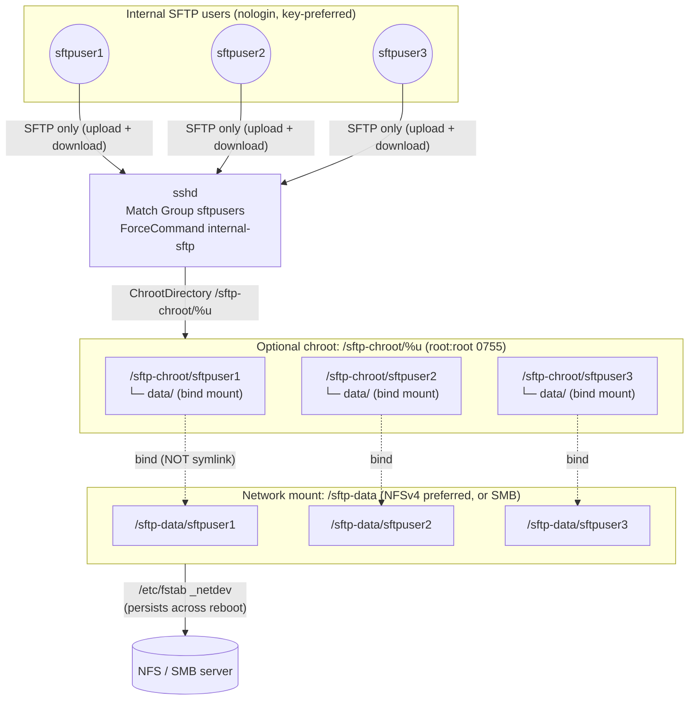

# Hardened Multi-User SFTP Server (RHEL 8) — Architecture

A single RHEL 8 host that gives a set of **internal** users their own SFTP
area. Every user can **upload and download** files in its own directory. User
data lives on a shared **NFS or SMB** filesystem mounted at `/sftp-data`;
external delivery is handled by that mount, so there is **no checksum step**.
Users have **no shell**, and an optional **chroot jail** locks each user into
its own directory.

This is a sibling of the RHEL 9/10 build in [`../sftp-server`](../sftp-server/)
but a different design: N equal read/write users on network storage, instead of
a writer/reader pair with a checksum-and-promote pipeline.

All names, UIDs, paths, mount details, keys, and (hashed) passwords come from a
config file (`sftp-rhel8.conf`) or environment variables — see
[`sftp-rhel8.conf.example`](./sftp-rhel8.conf.example).

---

## 1. Component overview

| File | Role |
|------|------|
| `setup-sftp-rhel8.sh` | Idempotent provisioning script. Creates the group and accounts, mounts the share (fstab + optional SMB credentials), builds per-user data dirs, optional chroot jails with bind mounts, SSH/SFTP hardening, and optional audit rules. |
| `sftp-rhel8.conf.example` | Template for all tunables and secrets (copy to `/etc/sftp-server/sftp-rhel8.conf`, `chmod 0600`). |

There is no checksum service and no systemd unit templates — persistence is
handled entirely through `/etc/fstab` (network mount + per-user bind mounts).

---

## 2. Data flow



**What happens for one user**

1. `sftpuser1` connects over SSH. `sshd` matches `Group sftpusers`, forces
   `internal-sftp` (no shell), and — if `USE_CHROOT=yes` — chroots into
   `/sftp-chroot/sftpuser1`.
2. Inside the jail the user sees only `data/`, which is a **bind mount** of
   `/sftp-data/sftpuser1` on the network share.
3. The user uploads (`put`) and downloads (`get`) freely within `data/`
   (umask `0027` → new files `0640`).
4. Files land directly on the NFS/SMB share, where the external side collects
   or delivers them out of band. No checksum is computed.

---

## 3. Why `data/` is a bind mount, not a symlink

Inside a chroot, an absolute symlink such as `data -> /sftp-data/sftpuser1`
resolves against the **jail root**, so `/sftp-data/...` no longer exists and the
link is dead. The working directory must therefore be a real mount inside the
jail. The script bind-mounts each user's share directory onto
`/sftp-chroot/<user>/data`, persisted in `/etc/fstab`:

```text
/sftp-data/sftpuser1 /sftp-chroot/sftpuser1/data none bind,nosuid,nodev,noexec,x-systemd.requires=/sftp-data 0 0
```

`x-systemd.requires=/sftp-data` orders each bind **after** the network share is
mounted; `nosuid,nodev,noexec` harden the exposed tree. `internal-sftp` is a
builtin of `sshd` (it runs before the chroot), so the jail needs **no** copied
binaries or libraries — nothing executable has to live under `/sftp-chroot`.

---

## 4. Permission model

```text
/sftp-data                       root:root  0755   mount point (share root)
/sftp-data/<user>                <user>:sftpusers 0700   (NFS/local: real per-user ownership)
/sftp-chroot                     root:root  0755
/sftp-chroot/<user>              root:root  0755   chroot anchor (sshd requirement)
/sftp-chroot/<user>/data         bind mount of /sftp-data/<user>
/etc/ssh/authorized_keys/<user>  root:root  0644   trust anchors OUTSIDE the jail
```

* **chroot requirement:** a `ChrootDirectory` must be owned by `root` and not
  writable by group/other, or `sshd` refuses the session — hence the root-owned
  `0755` jail roots with the writable `data/` mount one level down.
* **Least privilege:** on NFSv4/local storage each `/sftp-data/<user>` is
  `0700` and owned by that user, so users cannot see each other's files even
  without the chroot. `authorized_keys` live under `/etc/ssh/authorized_keys/`
  (root-owned), so a chrooted user can never edit its own trust anchor.

### NFSv4 vs SMB — an important ownership difference

| | NFSv4 (preferred) | SMB / CIFS |
|---|---|---|
| Per-user UID/GID ownership | **Preserved** (with idmapping) | **Not preserved** — the whole mount presents one identity |
| How isolation is enforced | Unix ownership **and** chroot | **chroot + separate subdirs only** |
| Ownership set by | `chown` on the real files | mount options `uid=`, `gid=`, `file_mode=`, `dir_mode=` |

CIFS maps every file on the mount to a single `uid`/`gid`, so `chown`/`chmod`
on individual subdirectories are not honoured. The script therefore does **not**
try to `chown` per-user dirs on an SMB mount; it relies on the chroot plus
distinct subdirectories for isolation. This is exactly why **NFSv4 is
preferred** — it keeps real per-user Unix ownership. If you must use SMB and
need the *server* to enforce per-user ACLs, that requires CIFS `multiuser` mode
with Kerberos (`sec=krb5`) or per-user credential caches — out of scope for this
single-shared-account build.

---

## 5. Storage mount & persistence

`MOUNT_TYPE` selects how `/sftp-data` is provided:

* **`nfs`** — writes an fstab line using NFSv4.2 by default:
  ```text
  nfs-server:/export/sftp /sftp-data nfs rw,hard,vers=4.2,_netdev,nosuid,nodev,noexec 0 0
  ```
  Requires `nfs-utils`.
* **`smb`** — writes a CIFS fstab line and, if the credentials file is missing,
  **creates the shared-account mapping** at `/etc/sftp-server/smb.cred`
  (`root:root 0600`):
  ```text
  //smb-server/sftp-share /sftp-data cifs vers=3.1.1,uid=0,forceuid,gid=4000,forcegid,file_mode=0660,dir_mode=0770,_netdev,nosuid,nodev,noexec,credentials=/etc/sftp-server/smb.cred 0 0
  ```
  ```text
  # /etc/sftp-server/smb.cred  (root:root 0600)
  username=<smb-service-account>
  password=<secret>
  domain=<AD-DOMAIN>          # optional
  ```
  One shared SMB service account backs the mount; the `gid=`/`*_mode=` options
  make every file group-owned by `sftpusers` so all chrooted users can
  read/write their own subtree. If `SMB_USERNAME`/`SMB_PASSWORD` are left empty,
  a **placeholder** cred file is written and you edit it by hand (keeping
  secrets out of the config file). Requires `cifs-utils`.
* **`none`** — you mount `/sftp-data` yourself; the script only provisions
  users, directories, and the chroot, and warns if the mount is absent.

`_netdev` (and, for the binds, `x-systemd.requires=/sftp-data`) guarantee the
mounts come up **after** the network at every boot. The script edits `/etc/fstab`
only inside a marked, idempotent block and writes a timestamped backup first.

---

## 6. scp / rsync compatibility (read this)

The hardening (`nologin` shell + `ForceCommand internal-sftp`) permits **only
the SFTP protocol**. That has a concrete effect on `scp`:

* **`scp` legacy protocol → does NOT work.** The classic scp/rcp protocol needs
  to run a remote command (`scp -t`) through a shell. With `ForceCommand
  internal-sftp` that exec is overridden, so the transfer fails. **`rsync` fails
  for the same reason** (it also needs a remote shell).
* **RHEL 8 ships OpenSSH 8.0p1**, whose `scp` uses the legacy protocol by
  default — so `scp` *from a RHEL 8 client* to this server will not work.
* **`scp` over the SFTP protocol → works.** OpenSSH **9.0** made `scp` use the
  SFTP protocol by default, and **8.7/8.8** added it behind `scp -s`. A client
  on OpenSSH ≥ 9.0 can `scp` transparently; on 8.7/8.8 use `scp -s user@host:…`.
* **Recommended for everyone:** use `sftp`, or a GUI SFTP client (WinSCP,
  FileZilla, etc.). These always speak the SFTP protocol and work unchanged.

```bash
sftp sftpuser1@<host>
sftp> put report.csv        # upload
sftp> get results.csv       # download
```

> Do **not** add a shell or the `scp` binary into the jail to make legacy scp
> work — that reintroduces the shell access this design removes.

Sources: [OpenSSH 9.0 release notes](https://www.openssh.com/txt/release-9.0),
[Red Hat: OpenSSH SCP deprecation in RHEL 9](https://www.redhat.com/en/blog/openssh-scp-deprecation-rhel-9-what-you-need-know).

---

## 7. Security standards traceability

| Control area | Implementation | Standard(s) |
|--------------|----------------|-------------|
| Least privilege accounts | `nologin` shell, no home login, dedicated group, fixed UID/GID | NIST AC-6; CIS RHEL 8 L2 |
| Access control | Optional per-user chroot; owner/group/mode `0700` on NFS/local dirs | NIST AC-3/AC-6; DISA-STIG chroot |
| Authenticator management | SSH keys preferred; passwords accepted only as SHA-512 crypt hashes; root-owned `authorized_keys` outside the jail; rotation via `chage` | NIST IA-5; CIS; DISA-STIG |
| SSH/SFTP hardening | Drop-in: no root login, no password by default, `internal-sftp` only via `Match Group`, forwarding/TTY/X11 off, login-grace/keepalive limits, warning banner | DISA-STIG OpenSSH SRG; NIST SC-8; CIS L2 |
| Transmission & crypto | FIPS-approved algorithms via system-wide crypto policy (not hardcoded ciphers) | FIPS 140-3; NIST SC-8/SC-13 |
| Storage hardening | Network mounts with `nosuid,nodev,noexec`; SMB credentials root-only `0600` | CIS; NIST SC-28 |
| Audit (optional) | `LogLevel VERBOSE` + `internal-sftp -l INFO`; optional auditd watch on `/sftp-data` | NIST AU-2/AU-12; DISA-STIG |
| Config management | Non-destructive `sshd_config.d` drop-in and marked `fstab` block; `sshd -t` validated before reload; fstab backup | NIST CM-6 |
| Input validation | Names/UIDs/paths/mount sources validated; hashed-password enforcement | OWASP; NIST SI-10 |

### Controls that FAIL if the host is not hardened

This is a generic build that *assumes* mandated controls are on. The script
**detects and warns** where they are not, because the protection then silently
does not apply:

| If disabled | What is NOT enforced | Re-enable with |
|-------------|----------------------|----------------|
| FIPS mode (`/proc/sys/crypto/fips_enabled = 0`) | SSH is not restricted to FIPS-approved crypto (SC-13) | `fips-mode-setup --enable && reboot` |
| Crypto policy ≠ FIPS | System-wide algorithm restriction | `update-crypto-policies --set FIPS` |
| SELinux not `Enforcing` | Mandatory access control (AC-3); SFTP to the share may be *denied* until labelled and the network-FS boolean is set | `setsebool -P use_nfs_home_dirs on` (or `use_samba_home_dirs on`); `semanage fcontext -a -t ssh_home_t '/sftp-chroot(/.*)?' && restorecon -Rv /sftp-chroot` |
| auditd inactive (with `ENABLE_AUDIT=yes`) | Transfer-directory auditing (AU-2/AU-12) is not recorded | `dnf install audit && systemctl enable --now auditd` |

---

## 8. Password securing & rotation (recommendations)

Keys are strongly preferred; if passwords must be used:

1. **Never store plaintext.** Provide a SHA-512 crypt hash in the config:
   ```bash
   openssl passwd -6            # or: mkpasswd -m sha-512
   ```
   The script refuses anything not starting with `$6$`.
2. **Protect the config file.** Keep `/etc/sftp-server/sftp-rhel8.conf`
   `root:root 0600`. Better still, source secrets at deploy time from a secrets
   manager and export them as environment variables so no hash is written to
   disk.
3. **Rotation.** `chage` limits (`PW_MAX_AGE`, default 60 days; `PW_MIN_AGE`;
   `PW_WARN_AGE`) satisfy STIG/CIS maximum-age rules. Rotate by generating a new
   hash and re-running the script, or rotate SSH keys by replacing the file in
   `/etc/ssh/authorized_keys/<user>`.

---

## 9. Usage

```bash
# 1. Copy and edit the config (users, mount, keys, and — if needed — hashed pws)
sudo install -D -m 0600 sftp-rhel8.conf.example /etc/sftp-server/sftp-rhel8.conf
sudoedit /etc/sftp-server/sftp-rhel8.conf

# 2. For SMB, either fill SMB_USERNAME/SMB_PASSWORD in the config, or let the
#    script create a placeholder and edit it directly:
sudo vi /etc/sftp-server/smb.cred      # root:root 0600

# 3. Provision (idempotent; re-run any time to apply changes)
sudo ./setup-sftp-rhel8.sh

# 4. Verify as a user
sftp sftpuser1@<host>
sftp> put report.csv
sftp> get results.csv
```

Environment variables of the same name override config values, e.g.:

```bash
sudo SFTP_USERS="alice bob" MOUNT_TYPE=smb \
     MOUNT_SOURCE="//nas/sftp" ./setup-sftp-rhel8.sh
```

Per-user auth uses `PUBKEY_<user>` / `PWHASH_<user>` variables (any `-` in the
user name becomes `_`), e.g. `PUBKEY_sftpuser1="ssh-ed25519 AAAA... alice"`.
