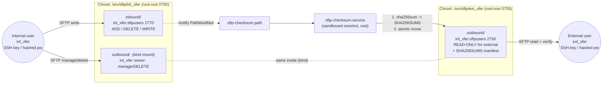

# Hardened SFTP Intermediary — Architecture

A single RHEL 9 / RHEL 10 host that acts as an intermediary drop-box between an
**internal** server (the writer) and a **cloud** server (the reader). One
internal account uploads files; one external account reads them; every imported
file gets a SHA-256 checksum before the reader can see it. Network routing
between the endpoints is out of scope.

All names, UIDs, paths, and (hashed) passwords come from a config file
(`sftp-server.conf`) or environment variables — see
[`sftp-server.conf.example`](./sftp-server.conf.example).

---

## 1. Component overview

| File | Role |
|------|------|
| `setup-sftp-server.sh` | Idempotent provisioning script. Creates the group, accounts, chroot jails, permissions, SSH/SFTP hardening, audit rules, and installs the checksum service. |
| `sftp-server.conf.example` | Template for all tunables and secrets (copy to `/etc/sftp-server/sftp-server.conf`, `chmod 0600`). |
| `sftp-checksum.sh` | Independent script: hashes each finished upload into one aggregate `SHA256SUMS` manifest and promotes the file from `inbound/` to `outbound/`. |
| `systemd/sftp-checksum.path.in` | inotify watcher (rendered → `/etc/systemd/system/sftp-checksum.path`). Fires on new inbound files. |
| `systemd/sftp-checksum.service.in` | Sandboxed oneshot that runs the checksum script (rendered → `/etc/systemd/system/sftp-checksum.service`). |

---

## 2. Data flow



The single canonical `outbound/` directory lives in the external jail and is
**bind-mounted** into the internal jail, so the internal user can delete
delivered files there while the external user keeps a read-only view of the
same files (enforced by the `2750` group `r-x` permission).

**Sequence for one file**

1. `int_xfer` uploads `report.csv` into `inbound/` (umask `0027` → file `0640`,
   group `sftpusers`).
2. systemd’s `.path` unit sees the change and starts the checksum service.
3. The service confirms the upload is *stable* (size steady, not held open),
   computes SHA-256, and **atomically moves** the file into `outbound/`.
4. It regenerates the single `outbound/SHA256SUMS` manifest from scratch.
5. `ext_xfer` reads `report.csv` from `outbound/` and can run
   `sha256sum -c SHA256SUMS` to verify integrity.

A file reaches `outbound/` **only after** its checksum exists, so the reader
never sees an unverified or half-written file.

---

## 3. Permission model — why the split works

Two **separate chroot trees** are used instead of one shared directory, so the
external account can never even *see* the inbound staging area.

| Path | Owner:Group | Mode | Internal user | External user |
|------|-------------|------|---------------|---------------|
| `/srv/sftp/<user>` (jail roots) | `root:root` | `0755` | — (chroot anchor) | — (chroot anchor) |
| `inbound/` (internal jail) | `int_xfer:sftpusers` | `2770` | read/write/**delete** | **no access** (different jail) |
| `outbound/` (external jail, canonical) | `int_xfer:sftpusers` | `2750` | owner rwx via bind mount | **read-only** (group `r-x`, no write) |
| `outbound/` (internal jail) | *bind mount of the above* | — | manage/**delete** | — (not in this jail) |
| files in `outbound/` | `int_xfer:sftpusers` | `0640` | manage/delete | read (group) |

* **Internal writes, external reads:** internal owns `inbound/`; promoted files
  are group-readable (`0640`, group `sftpusers`) and `outbound/` grants the
  external user only `r-x`.
* **File management from the internal account only:** the external user has no
  write bit on `outbound/`, so it can never add or delete — it can only read.
  The internal user owns `outbound/` and reaches it through a bind mount into
  its own jail, so **only** the internal account can delete delivered files.
* **Integrity note:** the manifest is rebuilt from the full directory on each
  promotion, so it self-heals after an internal deletion on the next upload;
  an admin can also re-run `sftp-checksum.sh` to refresh it immediately.
* **chroot requirement:** a `ChrootDirectory` must be owned by `root` and not
  writable by group/other, or `sshd` refuses the session — hence the `0755`
  root-owned jail roots with the writable working dir one level down.

---

## 4. Security standards traceability

The setup script tags each block with the standard it satisfies. Summary:

| Control area | Implementation | Standard(s) |
|--------------|----------------|-------------|
| Least privilege accounts | `nologin` shell, no home login, dedicated group, fixed UID/GID | NIST AC-6; CIS RHEL 9 L2 |
| Access control | Separate chroot jails; owner/group/mode + read-only outbound | NIST AC-3/AC-6; DISA-STIG chroot |
| Authenticator management | SSH keys preferred; passwords accepted only as SHA-512 crypt hashes; root-owned `authorized_keys` outside the jail; rotation via `chage` | NIST IA-5; CIS; DISA-STIG |
| SSH/SFTP hardening | Drop-in: no root login, no password by default, `internal-sftp` only, forwarding/TTY/X11 off, login-grace/keepalive limits, warning banner | DISA-STIG OpenSSH SRG; NIST SC-8; CIS L2 |
| Transmission & crypto | FIPS-approved algorithms via system-wide crypto policy (not hardcoded ciphers) | FIPS 140-3; NIST SC-8/SC-13 |
| Integrity | SHA-256 manifest generated before the reader sees a file | NIST SI-7; FIPS 140-3 digest |
| Audit | `LogLevel VERBOSE` + `internal-sftp -l INFO`; auditd watches on transfer dirs | NIST AU-2/AU-12; DISA-STIG |
| Config management | Non-destructive `sshd_config.d` drop-in; `sshd -t` validated before reload | NIST CM-6 |
| Service hardening | systemd sandbox on the checksum unit (`ProtectSystem=strict`, syscall filter, minimal capabilities) | NIST CM-7; CIS |
| Input validation | Names/UIDs/paths validated; no traversal; hashed-password enforcement | OWASP; NIST SI-10 |

### Controls that FAIL if the host is not hardened

This is a generic build that *assumes* mandated controls are on. The script
**detects and warns** where they are not, because the protection then silently
does not apply:

| If disabled | What is NOT enforced | Re-enable with |
|-------------|----------------------|----------------|
| FIPS mode (`/proc/sys/crypto/fips_enabled = 0`) | SSH is not restricted to FIPS-approved crypto (SC-13) | `fips-mode-setup --enable && reboot` |
| Crypto policy ≠ FIPS | System-wide algorithm restriction | `update-crypto-policies --set FIPS` |
| SELinux not `Enforcing` | Mandatory access control (AC-3); SFTP may also be *denied* until the trees are labelled | set `enforcing`; `semanage fcontext`/`restorecon` on `/srv/sftp` |
| auditd inactive | Transfer-directory auditing (AU-2/AU-12) is not recorded | `dnf install audit && systemctl enable --now auditd` |

---

## 5. Password securing & rotation (recommendations)

Keys are strongly preferred; if passwords must be used:

1. **Never store plaintext.** Provide a SHA-512 crypt hash in the config:
   ```bash
   openssl passwd -6            # or: mkpasswd -m sha-512
   ```
   The script refuses anything not starting with `$6$`.
2. **Protect the config file.** Keep `/etc/sftp-server/sftp-server.conf`
   `root:root 0600`. Better still, source secrets at deploy time from a secrets
   manager (HashiCorp Vault, `systemd-creds`, or a CI secret store) and export
   them as environment variables so no hash is written to disk.
3. **Initial passwords.** Generate them randomly per account, deliver them
   out-of-band, and force a change/rotation immediately (or use keys and skip
   passwords entirely).
4. **Rotation.** The script applies `chage` limits (`PW_MAX_AGE`, default 60
   days; `PW_MIN_AGE`; `PW_WARN_AGE`) to satisfy STIG/CIS maximum-age rules.
   Rotate by generating a new hash and re-running the script (idempotent), or
   rotate SSH keys by replacing the file in `/etc/ssh/authorized_keys/<user>`.

---

## 6. Usage

```bash
# 1. Copy and edit the config (set users, keys, and — if needed — hashed pws)
sudo install -D -m 0600 sftp-server.conf.example /etc/sftp-server/sftp-server.conf
sudoedit /etc/sftp-server/sftp-server.conf

# 2. Provision (idempotent; re-run any time to apply changes)
sudo ./setup-sftp-server.sh

# 3. Verify as the external user
sftp ext_xfer@<host>
sftp> get SHA256SUMS
sftp> get report.csv
sha256sum -c SHA256SUMS
```

Environment variables of the same name override config values, e.g.:

```bash
sudo INTERNAL_USER=svc_in EXTERNAL_USER=svc_out ./setup-sftp-server.sh
```
